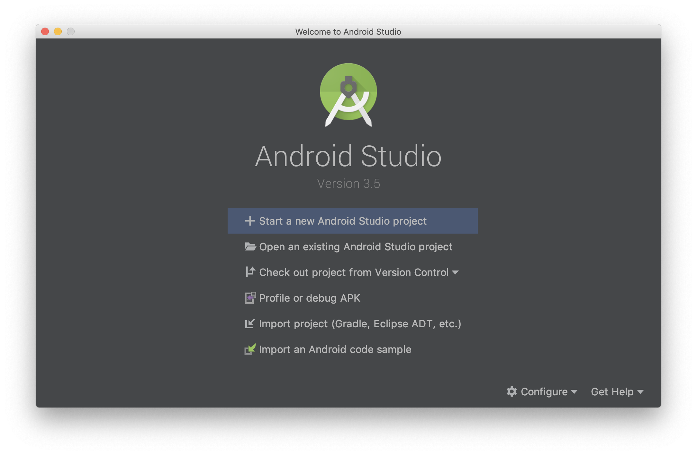
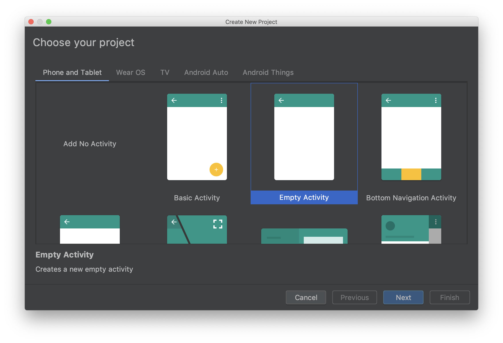
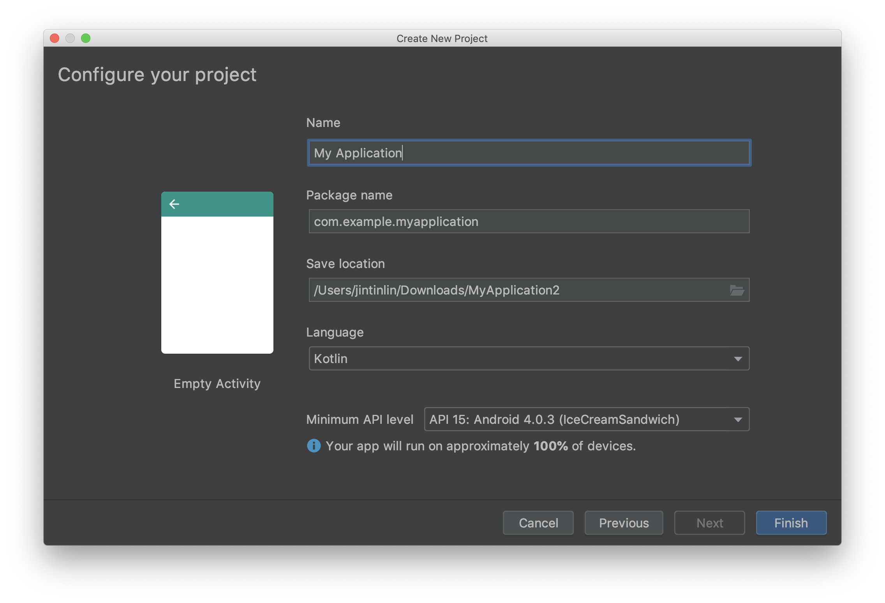
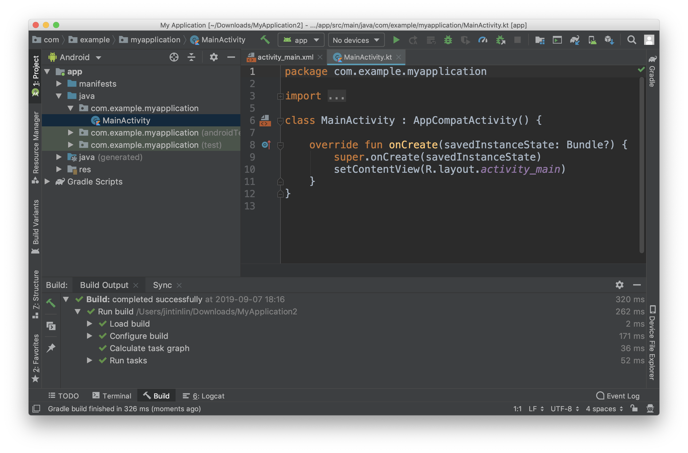
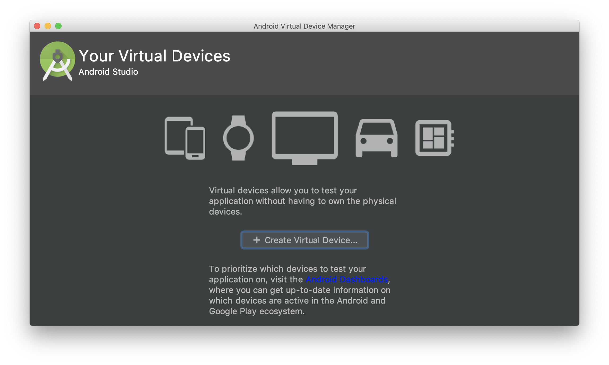
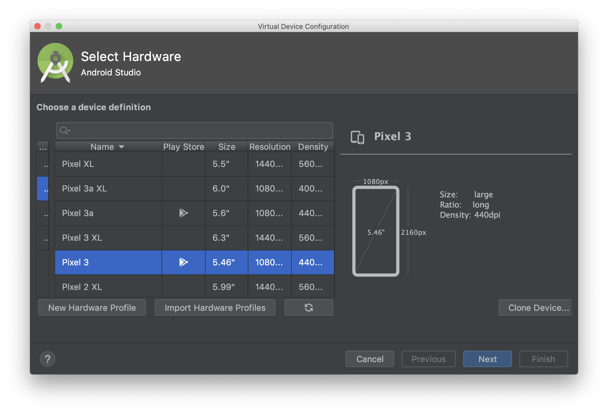
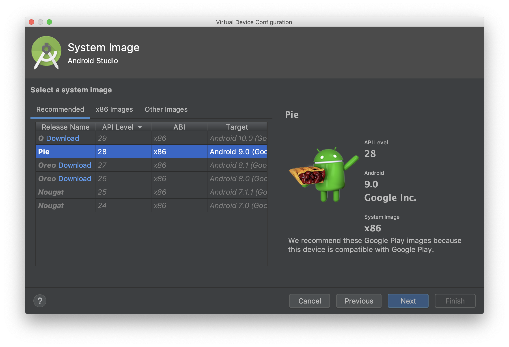
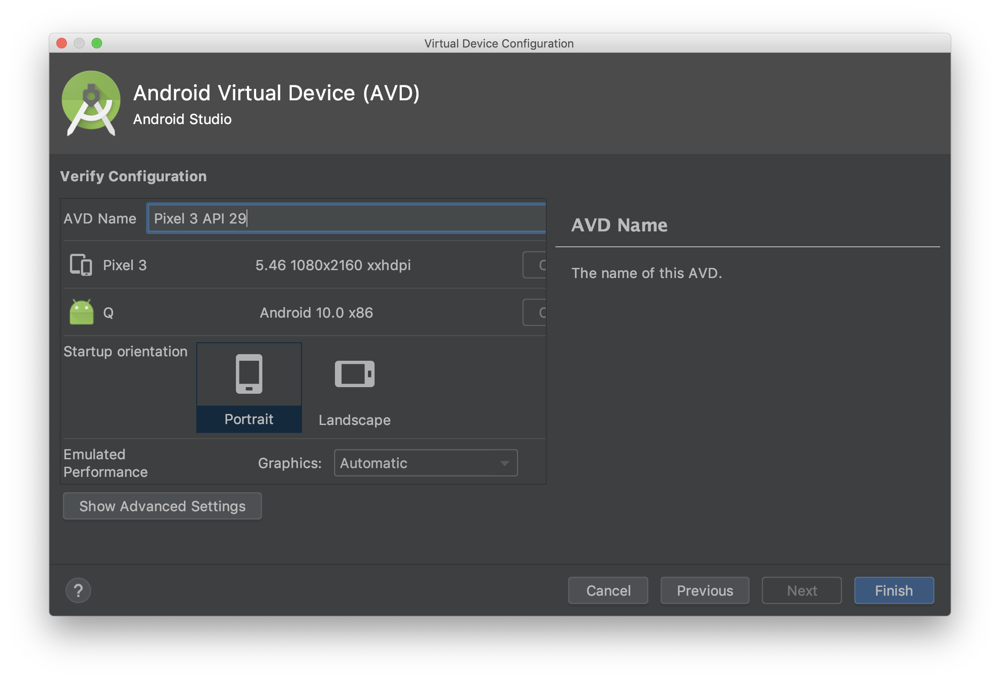
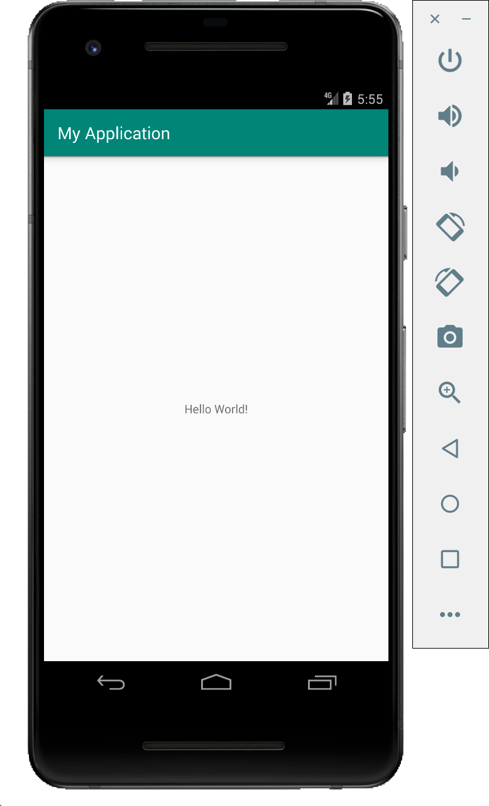

# 2. HelloWorld

## Hello world

### Android Studio

身為一個 Android 開發者，第一個要接觸的就是官方的 IDE - Android Studio 了。Android Studio 是基於 IntelliJ IDEA 的一個分支，整合了所有 Android 開發所需要使用的工具，由 Google 所維護，目前最新的版本是 3.5，不論是開發、測試、debug、profile、截圖或錄影幾乎所有功能都全包了。 這麼厲害怎麼能不下載。

下載連結：[https://developer.android.com/studio](https://developer.android.com/studio)

1. 這是下載後第一次打開會看到的畫面，可以直接點選 **Start a new Android Studio project** 進入下一步

   

2. 選 **Empty Activity** 後按 **Next**

   

   註：這一頁其他的 template 大家也可以玩玩看。

3. 這邊是需要填 Project 相關資訊的地方 

   

   > * Name：Project 名稱
   > * Package name：Project 的 default package，也被視為上架的 id。通常格式為 domain name 的相反順序：例：`com.example.myapplication`
   > * Save location：Project 存在電腦的位置
   > * Language：可選 Java/Kotlin。建議使用 Kotlin，畢竟 Google 已經公開宣布 Kotlin 將會是 Android 開發優先的語言。
   > * Minimum API level：最低支援的 Android 版本，越低就代表支援的裝置越多，但就必須捨棄新功能。4.0 以上就差別並不太大，我們可以保持預設值即可。

   修改後按 **Finish** 離開 wizard。

   **主畫面**

   

    第一次打開 Project 會自動開始第一次的 sync 跟 build。Sample project 通常都幾秒內就可以搞定，大家可以在視窗下方區塊看到 build 相關的資訊。 左上區則是 Project 的目錄結構，右上是目前打開編輯的檔案。 左、右、下三個邊上還有其他可以點開的 tab，比較常用的像是下方標示著 _6_ 的 Logcat ，可以看到 device 吐出的 log（_6_ 代表你可以使用 ⌘ + 6 來快速開關這個 tab）。 視窗上方是常用的工具列，我們可以點擊工具列中間的  \(Run\) 按鈕，來執行我們的這個小範例程式。

但很快的 Android Studio 就會跳出錯誤提醒我們還沒有連上任何裝置，有以下二個方式可以解決。

### 連接實機

1. 開啟裝置的 Developer options，每隻裝置可能略有不同。以 pixel 3 為例：打開 Settings -&gt; About phone -&gt; 連點 Build number 7次
2. 在 Settings -&gt; System -&gt; Developer options -&gt; 開啟 USB debugging
3. 把 Android device 透過 USB 連接到電腦上
4. 如果有跳出視窗是否允許 USB debug 點擊是

### 建立 emulator

1. 點擊工具列上的  \(AVD Manager\) 按鈕打開 AVD Manager 頁面，直接點擊 **Create Virtual Device...**

   

2. 選擇 Pixel 3 或其他你喜歡的模板，點擊 **Next**

   

3. 選擇最新的 P 或 Q

   

   如果沒有對應的 system image 無法繼續下一步，點選 **Download** 可以自動安裝。

   下載完後選擇 **Next**

4. 最後一步是設定 emulator 的參數（容量、記憶體等）

   

   我們可以全部使用預設值點擊 **Finish** 來完成設定

5. 在 emulator 列表頁直接點二下可以啟動 emulator

完成後我們再點一次 Run 按鈕，這次就會把我們的程式打包成 apk 然後載入到 device 上並自動執行。

順利的話就可以在手機或 emulator 上看到 app 跑起來的畫面了。

雖然目前還很陽春，所有介面都不能互動也不會更新。但這是非常重要的一個開始。 下個章節我們會介紹我們在 hello world 程式中使用到的所有元件。很快大家就可以成為一個優秀的 Android developer 了！

