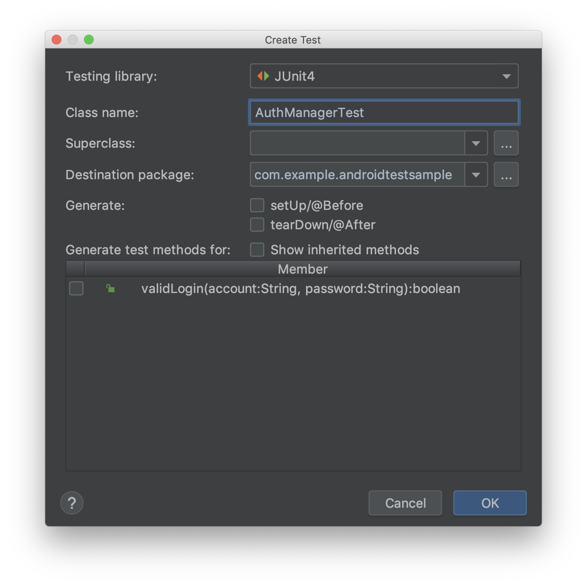

# 25. JUnit

測試是個非常重要的主題，還記得好幾年前，筆者去某大公司面試的時候，其中一題面試題目是：

```text
請說出測試 3A 是哪 3A ？
```

筆者的表情馬上變成 `(A_A)`，因為只有二個 A ，所以後來面試就沒有過了。

相信有了筆者的前車之鑑，大家應該會很想筆記下測試 3A 是哪三個吧，在解答前我們要先來介紹今天的主角 Unit Test。

### Unit Test

什麼是 Unit Test 呢？中文又叫單元測試，是測試每一個最小單元（函式）是否能夠正常執行的一種測試。 我們要怎麼測試一個函式是否正確執行呢？ 就是使用測試 3A 的原則：

* Arrange

  準備好測試環境、物件

* Act

  使用測試資料執行目標函式

* Assert

  比較測試結果跟預期結果是否一致

聽起來非常簡單直覺，但很多時候我們的函式是無法（或很難）測試的，比如說：

* 過多外部依賴或被直接建立：

  過多的外部依賴會導致我們很難提供一個乾淨的測試環境，導致我們需要不斷的提供假的替代物件。

  又或者有些 dependency 被直接宣告在程式碼裡，我們又無法置換掉，這部分我們就會失去控制權。

* 有副作用的函式：

  副作用通常指的是這個函式，除了我們想要做的目的外，還會影響到其他事物，可能導致每次執行結果都不一樣，這樣我們就無法判斷是否執行結果正確。比如說一個函式內部會去修改個全域變數，然後回傳結果跟全域變數有關等。

* 函式太大或太多 if-else 判斷式：

  怎麼樣叫做測完一個函式呢？至少我們需要每一行程式碼都有執行到，但是函式太大或太多 if-else 通常會導致我們每一個測試只能涵蓋著某部分的程式碼，我們必須提供更多不同的測試資料才能測完一個函式。

* 沒有回傳值：

  因為沒有回傳所以無從比較，並不是函式一定要有回傳值，但如果可以的話，直接檢查回傳值是最好的。

  一個可行的替代方案是我們可以檢查是不是有呼叫到該呼叫的程式碼。

  比如說一個函式要做 DB 的 init，我們可以去問 DB 是否有被 init 而不是要求函式回傳。

所有的問題都回歸到一個源頭，我們寫的程式不夠好測。 這時候就需要做些函式的重構或是架構調整才有辦法讓程式碼變的好測試。 所以近年來出現了另一種開發的流程叫做 TDD ，試著要解決這個問題。

### TDD

TDD stands for Test-Driven-Development，中文有人翻為測試先行，既然函式很難寫測試，那我們可不可以用測試的角度來規劃程式該怎麼寫。另一方面我們也不知道我們寫的測試有沒有幫助，所以 TDD 寫完測試後會先跑一次得到 fail 的結果，才回頭把程式主體寫完，當測試狀態從 fail 變成 success，就是寫完的時候了。

> 是不是超像在寫 leetcode 的......

我們不在此太多著墨，有興趣的讀者請自行參考：  
 [https://en.wikipedia.org/wiki/Test-driven\_development](https://en.wikipedia.org/wiki/Test-driven_development)

### JUnit

JUnit 是可以在 Java 層運作的一個 Unit test framework。

通常專案建立的時候都會自動設好了，但還是可以先檢查是否已經有正確的 dependency 宣告：

```groovy
dependencies {
    testImplementation 'junit:junit:4.12'
}
```

> `testImplementation` 代表這個 dependency 只會在測試的時候需要。

假設我們有個 class 如下：

```kotlin
class AuthManager {

    fun validLogin(account: String, password: String): Boolean {
        if (account.length < 6) {
            return false
        } else if (password.length < 8) {
            return false
        }
        return true
    }
}
```

`validLogin` 函式會需要檢查 `account` 跟 `password` 的長度，我們把游標移到 class 上按下 ⌥ + ↩ ，選擇 **Create test**，Android Studio 會跳出建立測試的畫面如下： 



**setup/@Before** 跟 **tearDown/@After** 是跑在每個測試項目的一開始跟最後的二個函式。 當有多個測試函式在同個檔案時， `setup` 跟 `tearDown` 就會被呼叫多次，如果有些共用的邏輯可以使用這二個函式來處理初始化或是清除資源等。

下方 Member 區塊裡的函式列表有被打勾的話會建立相對應的測試函式，也可以略過自己手動建立。

接下來會問你要放在哪個目錄下，還記得我們在 Hello world 中有提到，`androidTest/` 是跟 Android sdk 有關的測試，而 `test/` 是跟 platform 無關的測試。 我們的 `AuthManager` 跟 platform 無關，所以選擇 `test/` 目錄，接下來就會看到自動建立的 test class 內容如下：

```kotlin
class AuthManagerTest {

    @Before
    fun setUp() {
    }

    @After
    fun tearDown() {
    }

    @Test
    fun validLogin() {
    }
}
```

`@Test` 是 JUnit 提供的 annotation，代表一個實際的測試案例，我們先寫一個會失敗的例子如下：

```kotlin
@Test
fun validLogin() {
    val authManager = AuthManager()
    val result = authManager.validLogin("123456", "")
    Assert.assertEquals(true, result)
}
```

> 我們預期密碼為空值的時候登入也會成功，所以應該要是個失敗的測試。

IDE 在函式的前面會有個綠色小箭頭可以點來單獨跑一個測試，也可以在檔案上按右鍵選 **Run 'AuthManagerTest'**，或是在你的 module 上按右鍵選擇 **Run 'All Tests'** 會得到以下的結果

```text
java.lang.AssertionError:
Expected :true
Actual   :false
<Click to see difference>
```

我們把 test 修改為正確的例子如下：

```kotlin
@Test
fun validLogin() {
    val authManager = AuthManager()
    val result = authManager.validLogin("123456", "12345678")
    Assert.assertEquals(true, result)
}
```

再跑一次，現在就會正常了！

是不是很有趣呢？

但其實還沒完，`validLogin` 有二個參數而且都是 string，這個排列組合有超多可能的，我們怎麼知道我們要寫多少測試呢？

通常我們無法測試所有的條件，而且事實我們也不需要如此，就像二元一次方程式只要二個點就可以決定一個線，只要了解商業邏輯，把正常跟會導致錯誤的條件都涵蓋的話，理論上就已經足夠了。

另一個技巧是降維度，假設 string 有 n 種可能，我們的 `validLogin` 將會有 n  _n 種可能，如果我們將 `validLogin` 拆成 `validAccount` 跟 `validPassword` 二個，就會變成只有 2_  n 種可能，而且拆出來的函式也能更清楚表達，是不是更美好呢？

以上就是今天的全部內容了，希望大家都能掌握 3A 的原則！！ 

參考資料： [https://developer.android.com/training/testing/fundamentals](https://developer.android.com/training/testing/fundamentals) [https://developer.android.com/studio/test](https://developer.android.com/studio/test) [https://en.wikipedia.org/wiki/Unit\_testing](https://en.wikipedia.org/wiki/Unit_testing)

