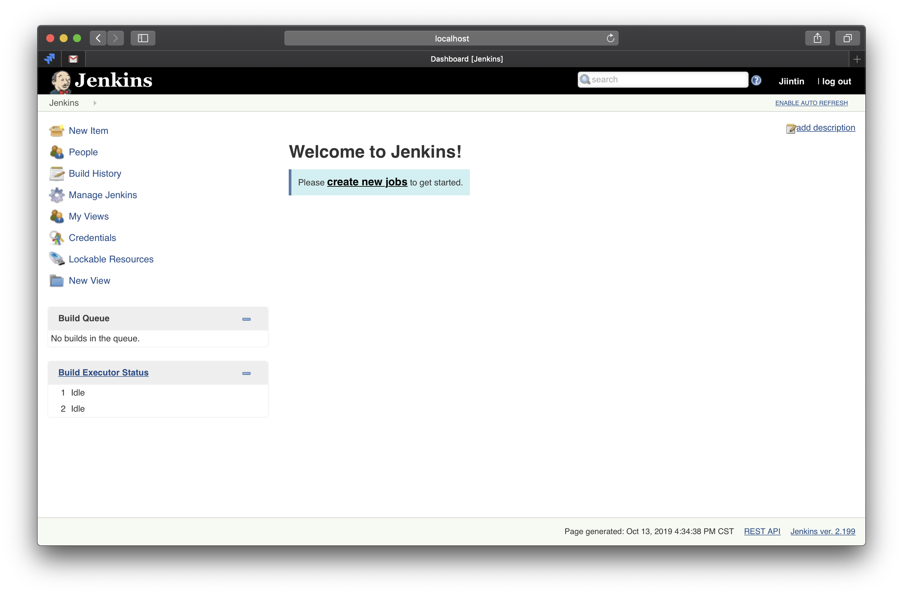

# 28. Jenkins

當我們有了良好的測試之後，就可以開始建立自動化流程了，Android app 的上架送審其實很繁瑣，雖然有簡單的 web 介面可以使用，但試想每次 release 都要做同樣的動作，是不是很浪費生命呢？

> Play Console 有開放 api ，如果有興趣自己接 api 完成上傳 apk 的話可以參考： [https://developers.google.com/android-publisher/getting\_started](https://developers.google.com/android-publisher/getting_started)

### CI/CD

身為工程師的我們，除了不斷優化我們的程式本身，同時也應該優化我們的工作流程。 如果可以在 slack 打個指令、或用 git 下個 tag 就自動幫我們做好 release 的動作該有多好！ 這也就是為什麼近年來 CI/CD 會變成大家常掛在嘴邊的 buzzword 了！

CI/CD 到底是在做什麼呢？ CI stands for Continuous Integration and CD stands for Continuous Delivery，中文翻成持續整合跟持續交付，有以下最主要的三個任務： 1. Build 2. Test 3. Deploy

> 聰明的大家應該知道 CI 跟 CD 比起來就是少了 Deploy 吧！

## Jenkins

講到 CI/CD 就不能提一下我們 CI/CD 界的 jenkins 老大哥，jenkins 是一個基於 Java 開發的持續整合工具，因為 open source 跟易於拓展廣受大家喜歡。

因為 jenkins 太強大了，可以裝在各種機器上（得益於 JVM），也擁有各式各樣的 plugin 可以使用，有時反而覺得難以上手。我們今天將會著重在如何安裝與基礎使用。

### Install

如果你是使用 Mac 系統，可以直接用萬能的 `brew`：

```text
brew install jenkins
```

> 如果你沒聽過 `brew`，花個幾分鐘你的人生將徹底改變。 [https://brew.sh/](https://brew.sh/)
>
> `brew` 安裝完了以後附帶著貼心小說明，花點時間看一下怎麼啟動 jenkins：
>
> ```text
> To have launchd start jenkins now > and restart at login:
>   brew services start jenkins
> Or, if you don't want/need a background service you can just run:
>   jenkins
> ```

如果不是 mac 可以直接官方網頁下載安裝： [https://jenkins.io/zh/download/](https://jenkins.io/zh/download/)

啟動 jenkins 後，使用 [http://localhost:8080/](http://localhost:8080/) 連到我們的 jenkins，一開始還沒有任何帳號存在，因為安全性的問題會需要提供 `~/.jenkins/secrets/initialAdminPassword` 裡的內容給 jenkins 來確認是本機使用者。 再來會有些設定可以選擇，可以安裝建議的 package 就好，之後有需要再新增其他的也很方便。 再來就是建立 admin 帳號了，最後就會看到我們的主畫面囉！ 



### Create Job

可以在主頁面選 **create new jobs** 或是左方選單的第一個 **New Item** 來建立一個工作項目，輸入任意名稱後選擇 **Freestyle project** 後點選 **OK** 進行下一步。

在接下來的設定頁面，上方可以看到好幾個 tab，我們一起來看以下幾個比較重要的 tab：

* General：

  勾選 **GitHub project**，輸入自己的 github repo url，例如：[https://github.com/Jintin/Clerk](https://github.com/Jintin/Clerk)

* Source Code Management：  勾選 **Git**，有以下二種資訊需要提供：
  * 輸入 Repository URL，例如：[https://github.com/Jintin/Clerk.git](https://github.com/Jintin/Clerk.git)
  * 設定 Credentials，有好幾種可以選擇，推薦使用 SSH 。

    > 設定 SSH 參考連結：[https://help.github.com/en/articles/generating-a-new-ssh-key-and-adding-it-to-the-ssh-agent](https://help.github.com/en/articles/generating-a-new-ssh-key-and-adding-it-to-the-ssh-agent)
* Build Triggers：  勾選 **GitHub hook trigger for GITScm polling** ，之後建立 github 的 webhook 的時候會用到。
* Build：

  選擇 **Execute shell**，這邊指定我們的 test 指令，比如說 `./gradlew test` 或是 `./gradlew connectedAndroidTest`，當我們想要 release 的時候也可以把 command 封裝成 `gradle` 指令，

最後按下 **Save** 會回到 Job 的首頁，左邊的選單會有個 **Build Now** ，點了之後就會啟動我們第一個 build，沒多久應該會發現我們的 build fail 了，出現了一個紅色的燈號。

> 不知道怎麼回去 job 設定頁嗎？直接點 `Configure` 就可以囉！

在 **Build History** 列表中點選我們的 build，會進入這個 build 的 detail page，點選 **Console Output** 來看看是什麼錯誤：

```text
* What went wrong:
A problem occurred configuring project ':app'.
> SDK location not found. Define location with an ANDROID_SDK_ROOT environment variable or by setting the sdk.dir path in your project's local properties file at '/Users/jintin/.jenkins/workspace/Test Jenkins/local.properties'.
```

照著這個說明把 Android SDK 設定好再按一次 **Build Now**，取決於你的 test script 設定不同，可能還需要設定 keystore 等資訊，但不管遇到什麼錯誤都可以用同樣方式查看 log 並修復。

> btw，我們沒有必要一個 job 完成所有的事情，可以多個 job 都指到同個 repo 然後負責不一樣的任務。

### Hook

我們已經可以主動建立 build 來 test 跟 release，可是我們要怎麼做到從 github 的 pull request 來建立 build 呢？

Git 的每個動作都可以掛 hook 來連結一段 script，而 github 也有提供 webhook 讓我們可以透過 http connection 來串接任意事件的通知到我們 jenkins 端。

> 記得要讓 jenkins 有個對外 ip 呦～
>
> 更多 hook 介紹：[https://git-scm.com/book/en/v2/Customizing-Git-Git-Hooks](https://git-scm.com/book/en/v2/Customizing-Git-Git-Hooks)

回到 github 設定頁面，點選 **Settings** -&gt; **Webhooks** ，點選 **Add webhook** 。 Payload URL 輸入 jenkins 對外的 url 加上 `/github-webhook`，content type 選 application/json ，trigger 方式選 **Let me select individual events.** ，然後勾選 **Pull requests** 以及其他你想關注的事件，這樣當事件發生的時候，jenkins 就會被通知然後產生新的 build 了。

### Alternative Service

除了 jenkins 外，如果你是 open source project 或用量不大也可以考慮 [Travis](https://travis-ci.org/)、[Circle CI](https://circleci.com/) 等雲端服務喔！ 另外如果對 GCP 沒有距離感的話也可以試試看 [Cloud Build](https://cloud.google.com/cloud-build/)。

以上就是今天全部內容了，祝大家都有著美好的開發人生。

參考資料： [https://jenkins.io/](https://jenkins.io/)

