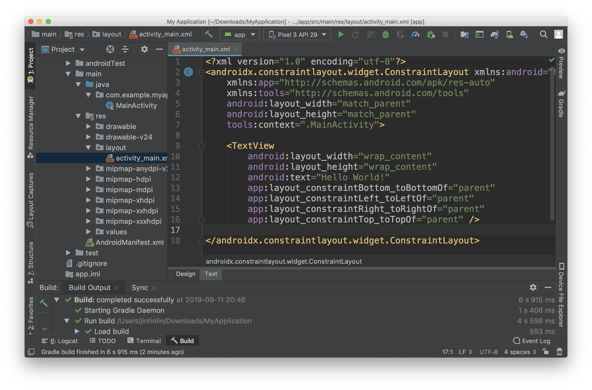

# 4. View and Xml

上一篇我們提到 Android app 開發主要的時間都會花在 `java/`、`res/` 與 `AndroidManifest.xml`，我們就先來看看 `res/` 下有什麼檔案吧。

```text
└── res
    ├── drawable
    │   └── ic_launcher_background.xml
    ├── drawable-v24
    │   └── ic_launcher_foreground.xml
    ├── layout
    │   └── activity_main.xml
    ├── mipmap-anydpi-v26
    │   ├── ic_launcher.xml
    │   └── ic_launcher_round.xml
    ├── mipmap-hdpi
    │   ├── ic_launcher.png
    │   └── ic_launcher_round.png
    ├── mipmap-mdpi
    │   ├── ic_launcher.png
    │   └── ic_launcher_round.png
    ├── mipmap-xhdpi
    │   ├── ic_launcher.png
    │   └── ic_launcher_round.png
    ├── mipmap-xxhdpi
    │   ├── ic_launcher.png
    │   └── ic_launcher_round.png
    ├── mipmap-xxxhdpi
    │   ├── ic_launcher.png
    │   └── ic_launcher_round.png
    └── values
        ├── colors.xml
        ├── strings.xml
        └── styles.xml
```

首先 `drawable/` 跟 `mipmap/` 資料夾下都是跟圖片相關的檔案，而 `values/` 則是跟多國語言、style 、color 等設定檔，比較值得介紹的是 `layout/` 下的檔案，很明顯的他是有關 layout 佈局的檔案我們來看一下 `activity_main.xml` 為例子。  在 project tab 的檔案列表中找到 `activity_main.xml` 這個檔案直接點二下可以在主畫面打開檔案。



> 如果你沒有看到這個畫面而是看到預覽畫面的話可以檢查主畫面左下的二個tab \[Design\|Text\]，是不是不小心點到了 Design 這個 tab。反之，你也可以點看看 Design 的預覽畫面來看你寫的程式在手機上會長什麼樣子。

如果對 xml 有點陌生的話可以參考這個網站：[https://www.w3schools.com/xml/xml\_whatis.asp](https://www.w3schools.com/xml/xml_whatis.asp)

而我們現在的檔案應該會長這個樣子：

```markup
<?xml version="1.0" encoding="utf-8"?>
<androidx.constraintlayout.widget.ConstraintLayout
    xmlns:android="http://schemas.android.com/apk/res/android"
    xmlns:app="http://schemas.android.com/apk/res-auto"
    xmlns:tools="http://schemas.android.com/tools"
    android:layout_width="match_parent"
    android:layout_height="match_parent"
    tools:context=".MainActivity">

    <TextView
        android:layout_width="wrap_content"
        android:layout_height="wrap_content"
        android:text="Hello World!"
        app:layout_constraintBottom_toBottomOf="parent"
        app:layout_constraintLeft_toLeftOf="parent"
        app:layout_constraintRight_toRightOf="parent"
        app:layout_constraintTop_toTopOf="parent" />

</androidx.constraintlayout.widget.ConstraintLayout>
```

可以看到有 `ConstraintLayout` 跟 `TextView` 這二個 elements 一層包著一層，其實跟 html 差不多的概念，一般的 GUI 介面都是由很多個方塊疊在一起組合而成的，每個 element 只需要決定自己的大小跟自己包含的其他 elements 之間的相對關係，當畫面在更新的時候就可以依這種樹狀結構來一層一層的重繪。

所有的 element 共同組合成我們眼睛所看到的畫面。在 Android 的世界裡，這些 elements 都共同繼承著 `View` 這個 class，而可以包著其他 `View` 的 class，也有著一個共同的祖先 —— `ViewGroup`。繼承關係圖如下：

```text
View
├── TextView
├── ......
└── ViewGroup
    ├── ConstraintLayout
    └── ......
```

不同的 `View` 有著不同的參數與特性可以呈現或解決不同需求，你也可以建立自己的 custom View 來封裝共同的行為。眼尖的朋友可能會發現 `ConstraintLayout` 在 xml 裡面的宣告包含著 package name 而 `TextView` 則沒有，這是因為 `ConstraintLayout` 是一個 custom View 而 `TextView` 是 Android 自帶的 `View` 所以 package name 可以省略。

> 如果遇到你很陌生的 `View` 可以按著 ⌘ 點擊該 `View` 的 name，Android Studio 會自動帶你跳到相對應的 class 檔案。

我們可以試著修改一些程式碼來看能夠改出什麼不一樣的東西，先試著把顯示的字串改成你自己喜愛的樣子。

在程式碼中找到這行 `android:text="Hello World!"`，然後把 `"Hello World!"` 改成 `"哈囉!你好"` 然後重新 build code 到手機上，應該就會看到自己修改過後的版本。

`TextView` 還有很多常用的參數可以調整，比如說：`textColor`、`textSize`，也有些共同的參數是繼承於 `View` 的，比如說：`layout_width`、`background`。我們並不會在這裡列出所有參數，如果有興趣可以從以下連結獲得 `TextView` 的更多資訊。

[https://developer.android.com/reference/android/widget/TextView](https://developer.android.com/reference/android/widget/TextView)

> 你也可以透過 Android Studio 的自動完成來窺探目前 `View` 所支援的參數。

以上就是本章的內容了，如果有什麼想要補充的也歡迎在留言跟我說。

